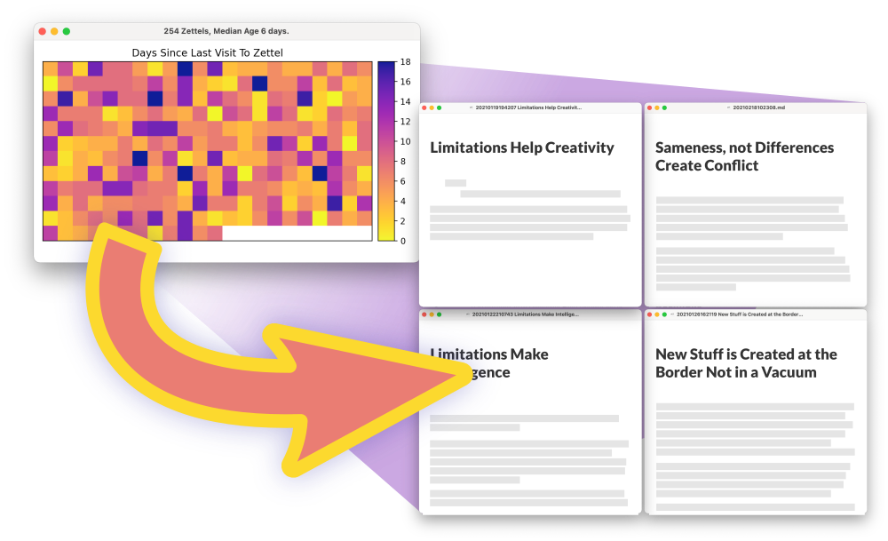

# Zettelwarmer

> An additional tool to Zettlr/Obsidian to randomly show you Zettels. Useful if you want to be reminded
> of what you have thought before, to find new possible interconnections and insights.
>
> Gives more weight to Zettels that haven't been seen (by this tool) in a while. The older the
> Zettel, the more probable it will be picked. See Andy Matuschak's [Evergreen note maintenance approximates spaced repetition](https://notes.andymatuschak.org/z2HUE4ABbQjUNjrNemvkTCsLa1LPDRuwh1tXC?stackedNotes=z6yfTwYekzvBkVjeH7WBUrSAJhyGTMYDAyYW7).
>
> Also see [zettelcon](https://github.com/whateverforever/zettelcon) for automatic backlink creation.



## Usage

Put it somewhere in your path, or make a shell alias to use it with your favorite flags.
I added a reminder to my `/etc/motd` to warm up my Zettels once in a while, and do it using this alias:

```
alias heat-zettels="python /...path.../zettelwarmer.py --folder /...path.../Zettels/ --numzettels 6"
alias show-zettels="python /...path.../zettelwarmer.py --folder /...path.../Zettels/ --visualize-only
```

```
(base) ➜  ~ python zettelwarmer.py --help
usage: zettelwarmer.py [-h] [-f FOLDER] [-n NUMZETTELS] [-if IMPORTANCE_FUN]
                       [-s SUFFIXES [SUFFIXES ...]] [-p PICKLENAME] [-vo]

Tool to revisit random Zettels from your collection. Gives more weight to old
Zettels that you haven't seen in a while.

optional arguments:
  -h, --help            show this help message and exit
  -f FOLDER, --folder FOLDER
                        Path to folder with all the zettels in it. Defaults to
                        current directory.
  -n NUMZETTELS, --numzettels NUMZETTELS
                        Number of Zettels to pick and open.
  -if IMPORTANCE_FUN, --importance-fun IMPORTANCE_FUN
                        Function of age, used to weight note-picking
                        probability. Possible values are linear, quadratic,
                        log
  -s SUFFIXES [SUFFIXES ...], --suffixes SUFFIXES [SUFFIXES ...]
                        List of valid suffixes to consider as Zettel files.
                        Defaults to .md
  -p PICKLENAME, --picklename PICKLENAME
                        Name of the pickle file to save file ages into. Will
                        be saved in the Zettel folder.
  -vo, --visualize-only
                        Do not open or modify anything, only show the heatmap.
```

## Requirements

As of now, it's specific to macOS by using the built-in `open` command. This command is used
to launch a markdown viewer to open the Zettels. This also requires you to have a markdown viewer
like Typora or MacDown setup as the standard tool to open markdown files.

## Feature Ideas

- [ ] Calculate how long it will take until all (or say 90%) of notes are "warm" (i.e. not older than X)
